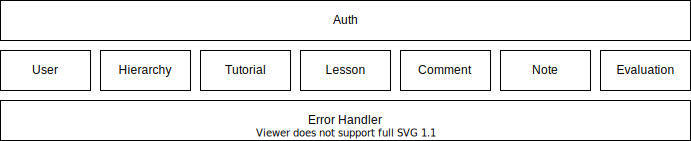
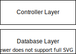

# Design

Each component is independent of other components. Each component has it's own data and no other component knows its data. 
One component don't even use the objects of other components, they interact with each other through a well defined interface.

Most of the components have two layers: the controller layer and the database layer. Database layer is responsible for database related operations. 
The controller layer uses the database layer to serve APIs. 

The exceptions are 
- Auth Layer: Every request passes through Auth layer and this layer is responsible for
checking whether the request is from an authentic source. 
- Error Handler Layer: If any error is found, an exception is thrown and Error Handler layer is responsible for 
generating appropriate error response. 
- Cache Layer: If an API is set to be cached, this cache layer caches API response. Once cached, any further request to that API 
will be served from the cache, until it expires. 

## Stacks Used
Programming Language: Java

Framework: Spring Boot

Database: MongoDB

Cache: Redis
